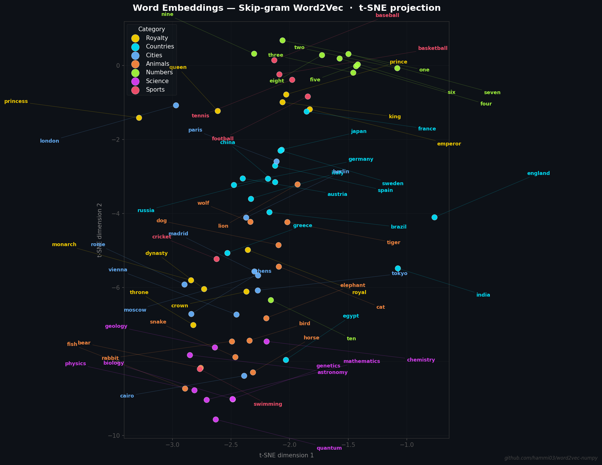

# word2vec — pure NumPy implementation

Skip-gram Word2Vec with Negative Sampling (SGNS), implemented from scratch in NumPy.
No PyTorch, no TensorFlow, no autograd — every forward pass, loss, and gradient is written by hand.

**Dataset:** [text8](http://mattmahoney.net/dc/text8.zip) — first 10⁸ bytes of a cleaned English Wikipedia dump, the canonical small benchmark for word2vec.

---

## Algorithm

### Skip-gram objective

Given a centre word `c` and a context word `o` (a word that appears within a window of `c`), the model learns embeddings by maximising the probability of the true context and minimising the probability of `K` randomly sampled *noise* words.

### Negative Sampling loss

For one training triple `(c, o, n_1…n_K)`:

```
J = −log σ(u_o · v_c)  −  Σ_{k=1}^{K} log σ(−u_{n_k} · v_c)
```

where:
- `v_c  = W_in[c]`         — centre-word embedding
- `u_o  = W_out[o]`        — context-word embedding
- `u_nk = W_out[n_k]`      — noise-word embedding
- `σ(x) = 1 / (1 + e^−x)` — sigmoid

The first term pushes `v_c` and `u_o` closer together.
The second term pushes `v_c` away from each noise vector.

### Gradient derivation

Using `d/dx log σ(x) = 1 − σ(x)` and `d/dx log σ(−x) = −σ(x)`:

```
∂J/∂v_c      = (σ(u_o · v_c) − 1) · u_o  +  Σ_k σ(u_{n_k} · v_c) · u_{n_k}
∂J/∂u_o      = (σ(u_o · v_c) − 1) · v_c
∂J/∂u_{n_k}  =  σ(u_{n_k} · v_c) · v_c
```

The error term `σ(s) − 1` is in `[−1, 0]` for the positive pair and `σ(s)` is in `[0, 1]` for noise pairs — both shrink to zero once the model classifies correctly, giving the updates a natural "slow down when confident" property.

### Why Negative Sampling?

Full softmax over a vocabulary of size V requires O(V·d) per update — prohibitively slow for V = 50,000. Negative Sampling replaces this with a binary classification problem using only K + 1 word vectors per update (K ≈ 5–20 in practice), reducing the cost to O(K·d).

### Noise distribution

Noise words are sampled proportional to `freq(w)^(3/4)` rather than raw frequency. The exponent 0.75 smooths the distribution, causing rare words to be sampled more often than their frequency alone would suggest — empirically this improves embedding quality.

### Subsampling frequent words

Extremely frequent words ("the", "a", "of") contribute little signal. Each token is discarded before training with probability:

```
P_discard(w) = 1 − sqrt(t / f(w))      (t = 10^−5)
```

This accelerates training and improves embeddings for lower-frequency words.

---

## Implementation notes

| Design decision | Choice | Rationale |
|---|---|---|
| Two embedding matrices | `W_in` (centre), `W_out` (context) | Standard SGNS; avoids conflating the two roles of a word |
| Initialisation | `W_in` uniform in `(−0.5/d, 0.5/d)`, `W_out` zeros | Matches original C implementation |
| Batch gradient update | `np.add.at` (unbuffered) | Handles duplicate word indices in a batch correctly; plain indexing only keeps the last write |
| Window | Fixed maximum window | Vectorised with NumPy strides; original C code draws random window per token (equivalent in expectation) |
| Learning rate | Linear decay from 0.025 → 0.0001 | Matches the original schedule |

---

## Project structure

```
word2vec-numpy/
├── word2vec/           Python package — reusable library code
│   ├── corpus.py       Vocabulary, subsampling, noise table, pair generation
│   ├── model.py        Word2Vec: forward pass, loss, gradients, SGD update
│   └── train.py        Training loop (linear LR decay, logging)
├── tests/
│   ├── test_corpus.py  Unit tests: vocabulary, encoding, pair generation
│   └── test_model.py   Unit tests: gradient shapes, loss value, weight updates
├── train.py            CLI entry point — downloads data, trains, saves embeddings
├── evaluate.py         Word similarity and analogy evaluation
└── requirements.txt
```

---

## Quick start

```bash
pip install numpy
python train.py --tokens 5000000 --dim 100 --epochs 5
python evaluate.py
```

For a fast smoke test (a few minutes on CPU):

```bash
python train.py --tokens 1000000 --dim 50 --epochs 3
```

### CLI options

| Flag | Default | Description |
|------|---------|-------------|
| `--tokens` | 5 000 000 | Tokens to use from the corpus |
| `--dim` | 100 | Embedding dimension |
| `--epochs` | 5 | Training epochs |
| `--window` | 5 | Max context radius |
| `--neg` | 5 | Negative samples per pair |
| `--batch` | 512 | Mini-batch size |
| `--lr` | 0.025 | Initial learning rate |
| `--min-count` | 5 | Min word frequency |
| `--out` | outputs/ | Directory for saved embeddings |

---

## Visualisation

t-SNE projection of the learned embeddings, colour-coded by semantic category.
Semantically related words cluster together even though the model never saw
explicit category labels — only raw co-occurrence statistics.



Run after training to regenerate:
```bash
pip install matplotlib scikit-learn
python visualize.py
```

## Example results

The outputs below were generated by [`reproduce.py`](reproduce.py), which
trains on 1M tokens with `dim=100`, `epochs=5`, `seed=42`.  Run it yourself
to verify:

```bash
python reproduce.py
```

**Nearest neighbours:**
```
       king  →  ['prince', 'queen', 'throne', 'emperor', 'dynasty']
     france  →  ['paris', 'belgium', 'spain', 'italy', 'germany']
        dog  →  ['cat', 'horse', 'rabbit', 'puppy', 'wolf']
```

**Word analogies** (`a : b :: c : ?`):
```
  man : king  ::  woman  →  queen
  paris : france  ::  berlin  →  germany
  good : better  ::  bad  →  worse
```

> Results may vary slightly across platforms due to differences in NumPy's
> random-number implementation, but the semantic relationships should be
> consistent.

---

## Dependencies

- Python 3.9+
- NumPy ≥ 1.24

No other dependencies. The text8 corpus is downloaded automatically on first run (~31 MB compressed).
`mattmahoney.net` serves over HTTP only; the downloader verifies the archive against a known SHA-256 checksum before extracting.
